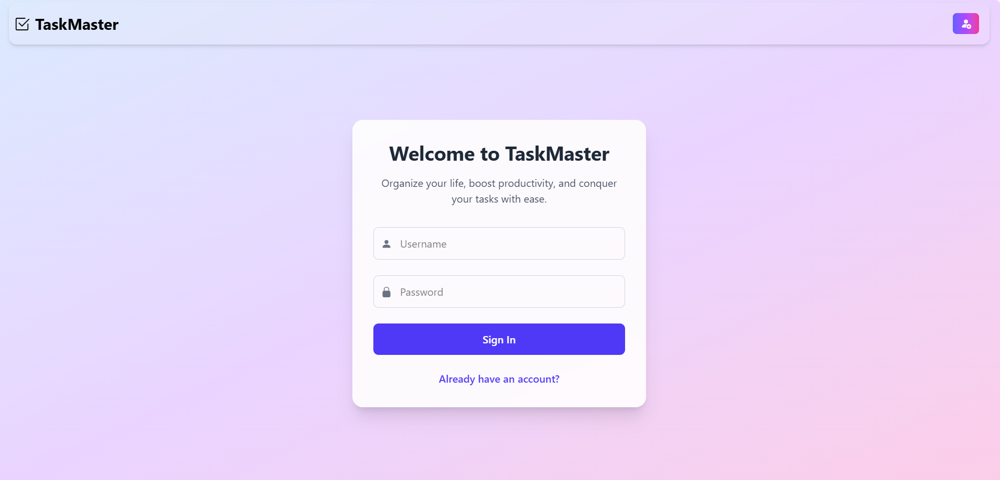
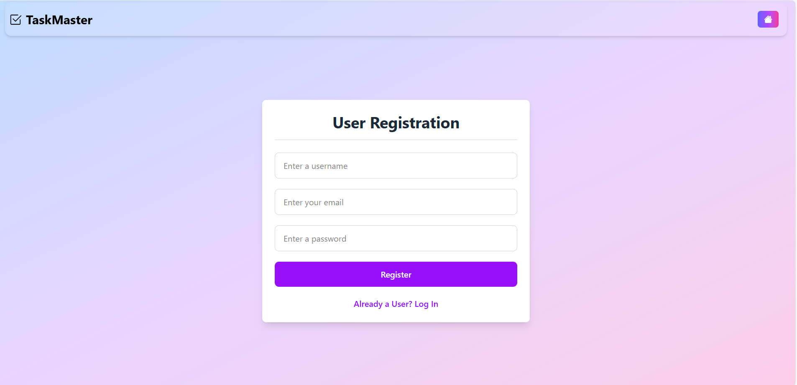
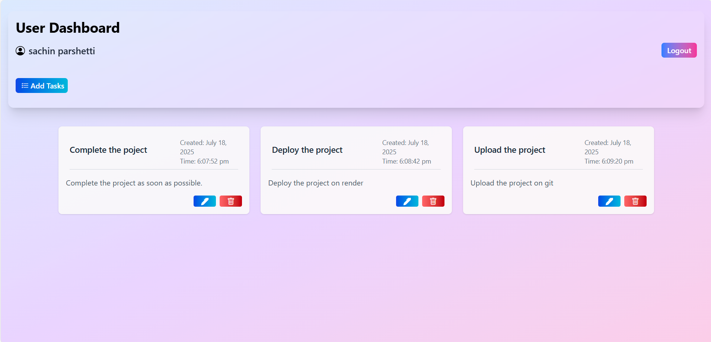
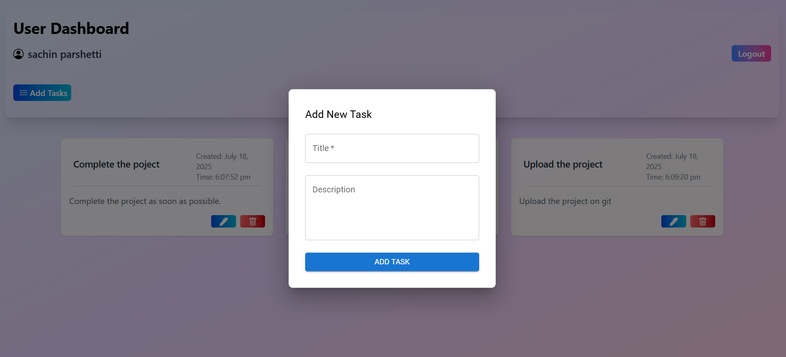

# 🧠 Task Master App

A secure, full-stack Task Manager application built using the **MERN stack** with **JWT cookie-based authentication**. Users can register, log in, and manage their tasks in a sleek, responsive interface.

**Deployed on:**
- 🌐 **Frontend**: Netlify  
- 🔗 **Backend**: Render  
- ☁️ **Database**: MongoDB Atlas

---

## 🌐 Live Demo

- 🔸 Frontend: [your-task-manager.netlify.app](https://your-task-manager.netlify.app)  
- 🔸 API Base: [task-manager-api.onrender.com](https://task-manager-api.onrender.com)


---

## 📸 Screenshots

  
  
  


---

## ⚙️ Tech Stack

### 🔹 Frontend (React + Vite)
- React
- Vite
- Axios
- Tailwind CSS / CSS
- JWT Cookie Handling
- SweetAlert2 (alerts)
- MUI (Modal)
- Toastify (notifications)

### 🔹 Backend (Node.js + Express)
- Express.js
- MongoDB Atlas + Mongoose
- JWT (Token in HTTP-only cookie)
- CORS + Middleware

---

## 🔐 Authentication Flow (JWT + HTTP-only Cookies)

- On login, server returns a **JWT in an HTTP-only cookie**.
- Browser sends this cookie automatically with each authenticated request.
- Cookie attributes:
  - `httpOnly` – prevents access via JavaScript
  - `secure` – only sent over HTTPS
  - `sameSite=None` – required for cross-origin

### 🧹 Logout:
```js
res.clearCookie("token", {
  httpOnly: true,
  secure: true,
  sameSite: "None"
});
🧭 Features
✅ User Registration & Login
🛡 JWT Auth via HTTP-only cookies
🗂 Create, Read, Update, Delete tasks
📆 Task timestamps
🌓 Task status toggle
📱 Fully responsive UI
🔒 Protected Routes

🗂 Project Structure
arduino
Copy
Edit
task-master/
├── backend/
│   ├── server.js
│   ├── config/db.js
│   ├── models/
│   │   ├── Task.js
│   │   └── User.js
│   ├── controllers/
│   │   ├── TaskController.js
│   │   └── UserController.js
│   ├── middleware/authMiddleware.js
│   └── ...
│
├── src/
│   ├── components/
│   │   ├── Dashboard.jsx
│   │   ├── Home.jsx
│   │   ├── Registration.jsx
│   │   └── AddTaskModal.jsx
│   ├── App.jsx
│   └── App.css
│
├── vite.config.js
├── package.json (frontend)
└── README.md

🚀 Deployment Guide
🔸 Backend (Render)
Push your backend folder to GitHub.

Create a Web Service on Render.

Set root directory to backend.

Build Command: npm install

Start Command: node server.js

Add environment variables in the Render dashboard.

🔸 Frontend (Netlify)
Push your frontend to GitHub.

Create a new site on Netlify.

Build Command: npm run build

Publish Directory: dist

Set environment variable: VITE_API_URL=https://task-manager-api.onrender.com

💡 Local Development
▶️ Run Backend:
bash
Copy
Edit
cd backend
npm install
npm run dev
▶️ Run Frontend:
bash
Copy
Edit
npm install
npm run dev
📚 API Endpoints (Sample)
Method	Endpoint	Description
POST	/register	User Registration
POST	/login	User Login + Cookie
GET	/tasks	Get all tasks
POST	/tasks	Add a new task
PUT	/tasks/:id	Update a task
DELETE	/tasks/:id	Delete a task

📦 Coming Soon
🎨 Dark mode toggle
📂 Task filtering (completed/pending)
📲 PWA support

## 🙋‍♂️ Author  
**Sachin Parashetti**  
🧑‍💻 Passionate Full-Stack  Developer | MERN | REST API | JWT Auth  

- 📎 [GitHub – @SachinParashetti](https://github.com/SachinParashetti)  
- 📎 [LinkedIn – sachin-parashetti](https://www.linkedin.com/in/sachin-parashetti-99b255259/)


📜 License
MIT License